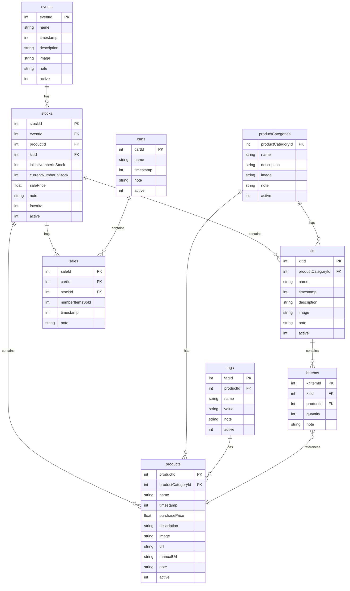

# Kits Extension - Implementation Plan

## Overview
This plan extends the kiosk system to support **product kits** - bundled collections of multiple products sold together. Kits will be treated like products in most aspects but maintain their composition of individual products.

## Requirements Summary
- Some products require batteries (need to bundle them)
- Kits are collections of multiple products
- Kits should be treated like individual products
- Kits have: description, image, note, category, gallery display
- Gallery shows sale prices (sum of component sale prices)
- Kits can be added to stock independently
- **Hybrid stock tracking**: Kits have independent stock but show warnings when component products are low

---

## Database Schema Changes

### New Tables

#### 1. `kits` Table
Stores kit definitions (the "product" aspect of kits).

```sql
CREATE TABLE kits (
    kitId INTEGER PRIMARY KEY,
    productCategoryId INTEGER,
    name TEXT NOT NULL,
    timestamp INTEGER NOT NULL,
    description TEXT,
    image TEXT,
    note TEXT,
    active INTEGER NOT NULL DEFAULT 1,
    FOREIGN KEY (productCategoryId) REFERENCES productCategories(productCategoryId)
)
```

**Fields:**
- `kitId`: Primary key
- `productCategoryId`: Category (same as products)
- `name`: Kit name
- `timestamp`: Creation timestamp
- `description`: Kit description
- `image`: Image filename (JPG/PNG)
- `note`: Internal notes
- `active`: Active status (1=active, 0=inactive)

#### 2. `kitItems` Table
Junction table linking kits to their component products.

```sql
CREATE TABLE kitItems (
    kitItemId INTEGER PRIMARY KEY,
    kitId INTEGER NOT NULL,
    productId INTEGER NOT NULL,
    quantity INTEGER NOT NULL DEFAULT 1,
    note TEXT,
    FOREIGN KEY (kitId) REFERENCES kits(kitId),
    FOREIGN KEY (productId) REFERENCES products(productId)
)
```

**Fields:**
- `kitItemId`: Primary key
- `kitId`: Reference to kit
- `productId`: Reference to product
- `quantity`: Number of this product in the kit
- `note`: Optional notes about this component

### Modified Tables

#### `stocks` Table Extension
Add `kitId` field to support kits in stock (nullable, mutually exclusive with `productId`).

```sql
ALTER TABLE stocks ADD COLUMN kitId INTEGER;
ALTER TABLE stocks ADD CONSTRAINT fk_stocks_kits 
    FOREIGN KEY (kitId) REFERENCES kits(kitId);
```

**Business Rule:** Either `productId` OR `kitId` must be set, but not both.

### Updated Entity Relationship Diagram



---

## Backend Implementation

### 1. Database Migration Script
**File:** `src/migrate_add_kits.py`

- Create `kits` table
- Create `kitItems` table
- Add `kitId` column to `stocks` table
- Add foreign key constraint
- Validate existing data integrity

### 2. Update `create_database.py`
Add new tables to SCHEMA dictionary:
- Add `kits` table definition
- Add `kitItems` table definition
- Update `stocks` table definition with `kitId` column

### 3. Admin API Endpoints
**File:** `src/admin.py`

#### Kit Management Routes:
```python
# List/View Kits
GET  /admin/kits                    # List all kits
GET  /admin/api/kits                # Get kits as JSON
GET  /admin/api/kits/<kit_id>       # Get single kit details

# Create/Update/Delete Kits
POST   /admin/api/kits              # Create new kit
PUT    /admin/api/kits/<kit_id>     # Update kit
DELETE /admin/api/kits/<kit_id>     # Delete kit (soft delete)

# Kit Items Management
GET    /admin/api/kits/<kit_id>/items           # Get kit components
POST   /admin/api/kits/<kit_id>/items           # Add product to kit
PUT    /admin/api/kits/<kit_id>/items/<item_id> # Update quantity
DELETE /admin/api/kits/<kit_id>/items/<item_id> # Remove product from kit

# Stock Validation
GET /admin/api/kits/<kit_id>/stock-check        # Check component availability
```

#### Key Functions:
- `get_kit_with_components(kit_id)` - Fetch kit with all products
- `calculate_kit_price(kit_id, event_id)` - Sum component sale prices
- `check_kit_stock_availability(kit_id, event_id)` - Validate component stock
- `get_kit_purchase_cost(kit_id)` - Sum component purchase prices

### 4. Stock Management Updates
**File:** `src/admin.py` (stocks section)

- Modify stock creation to accept either `productId` OR `kitId`
- Add validation: ensure only one is set
- Update stock queries to JOIN with both products and kits
- Display kit composition in stock list

---

## Frontend Implementation

### 1. Admin Kit Management Page
**File:** `templates/admin_kits.html`

**Features:**
- List all kits with thumbnails
- Filter by category and active status
- Create new kit button
- Edit/Delete actions
- Show component count badge

**Layout:**
```
┌─────────────────────────────────────────┐
│ Kits Management                         │
│ [+ New Kit]  [Filter: All ▼]  [☑ Active]│
├─────────────────────────────────────────┤
│ 🖼️ Kit Name          Category  Actions  │
│    (3 products)                [✏️] [🗑️] │
├─────────────────────────────────────────┤
│ 🖼️ Another Kit       Category  Actions  │
│    (2 products)                [✏️] [🗑️] │
└─────────────────────────────────────────┘
```

### 2. Kit Editor Modal
**Component:** Modal dialog in `admin_kits.html`

**Sections:**
1. **Basic Information**
   - Name (required)
   - Category (dropdown)
   - Description (textarea)
   - Image filename (text input)
   - Note (textarea)
   - Active checkbox

2. **Kit Components**
   - Product selector (dropdown)
   - Quantity input
   - [+ Add Product] button
   - List of added products with quantity and [Remove] button
   - **Price Preview**: Shows sum of component sale prices

**Validation:**
- Kit must have at least 1 product
- Product can only be added once per kit
- Quantity must be positive integer

### 3. Update Product Gallery
**File:** `templates/index.html`

**Changes:**
- Fetch both products and kits from backend
- Add visual indicator for kits (e.g., badge "KIT" or icon 📦)
- Display kit price (calculated from components)
- Kit detail modal shows component list

**Kit Card Example:**
```html
<div class="card product-card">
  <span class="badge bg-info position-absolute">KIT</span>
  
  <div class="card-body">
    <h5>Starter Kit</h5>
    <p>Contains: LED Badge, Battery, Manual</p>
    <p class="price">€15.00</p>
  </div>
</div>
```

### 4. Update Stock Management
**File:** `templates/admin_stocks.html`

**Changes:**
- Product selector becomes "Product/Kit" selector
- Show kit composition when kit is selected
- Display warning icon if component products are low in stock
- Show calculated kit price based on component sale prices

**Stock Warning Logic:**
```
For each kit in stock:
  For each component product:
    Check if product stock < kit stock
    If yes: Show warning ⚠️
```

### 5. Admin Navigation Update
**File:** `templates/admin_dashboard.html`

Add "Kits" menu item between "Products" and "Stocks".

---

## Business Logic

### Price Calculation
**Kit Sale Price** = Sum of component product sale prices at the event

Example:
```
Kit: "LED Starter Pack"
Components:
  - LED Badge (sale price: €10.00)
  - 9V Battery (sale price: €2.00)
  - Manual (sale price: €0.00)
Kit Sale Price = €12.00
```

### Stock Validation
When viewing/editing kit stock, show warnings:

```
✓ LED Badge: 50 in stock (sufficient)
⚠️ 9V Battery: 3 in stock (kit stock: 10) - LOW STOCK
✓ Manual: 100 in stock (sufficient)
```

**Warning Threshold:** Component stock < Kit stock

### Kit Purchase Cost
For reporting purposes, calculate kit purchase cost:
**Kit Purchase Cost** = Sum of component product purchase prices

---

## API Response Examples

### Get Kit with Components
```json
GET /admin/api/kits/1

{
  "kitId": 1,
  "name": "LED Starter Pack",
  "productCategoryId": 2,
  "categoryName": "Beginner Kits",
  "description": "Everything you need to start with LED projects",
  "image": "led-starter-pack.jpg",
  "note": "Popular kit for beginners",
  "active": 1,
  "timestamp": 1718564400,
  "components": [
    {
      "kitItemId": 1,
      "productId": 5,
      "productName": "LED Badge",
      "quantity": 1,
      "purchasePrice": 8.00,
      "note": null
    },
    {
      "kitItemId": 2,
      "productId": 12,
      "productName": "9V Battery",
      "quantity": 1,
      "purchasePrice": 1.50,
      "note": null
    }
  ],
  "totalPurchasePrice": 9.50
}
```

### Stock Check for Kit
```json
GET /admin/api/kits/1/stock-check?eventId=3

{
  "kitId": 1,
  "kitName": "LED Starter Pack",
  "kitStock": 10,
  "components": [
    {
      "productId": 5,
      "productName": "LED Badge",
      "requiredQuantity": 1,
      "availableStock": 50,
      "sufficient": true
    },
    {
      "productId": 12,
      "productName": "9V Battery",
      "requiredQuantity": 1,
      "availableStock": 3,
      "sufficient": false,
      "warning": "Stock insufficient for kit quantity"
    }
  ],
  "allSufficient": false
}
```

---

## Implementation Steps

### Phase 1: Database Foundation
1. Create migration script for new tables
2. Update `create_database.py` with new schema
3. Update `assets/db.mmd` diagram
4. Test database creation and migration

### Phase 2: Backend API
1. Implement kit CRUD endpoints
2. Implement kit items management endpoints
3. Add stock validation logic
4. Add price calculation functions
5. Update stock endpoints to support kits
6. Test all API endpoints

### Phase 3: Admin UI - Kit Management
1. Create `admin_kits.html` template
2. Implement kit list view
3. Create kit editor modal
4. Implement kit component management UI
5. Add client-side validation
6. Test kit creation and editing

### Phase 4: Admin UI - Stock Integration
1. Update stock management to support kits
2. Add kit selector to stock creation
3. Implement stock warning display
4. Update stock list to show kits
5. Test stock operations with kits

### Phase 5: Gallery Integration
1. Update gallery query to include kits
2. Add kit visual indicators
3. Implement kit detail modal
4. Show component list in kit details
5. Test gallery display

### Phase 6: Testing & Documentation
1. Test complete kit workflow
2. Test stock warnings
3. Test price calculations
4. Verify reporting includes kits
5. Update user documentation

---

## Testing Checklist

### Database
- [ ] Tables created successfully
- [ ] Foreign keys enforced
- [ ] Migration preserves existing data
- [ ] Stock constraint (productId XOR kitId) works

### Backend
- [ ] Create kit with components
- [ ] Update kit information
- [ ] Add/remove products from kit
- [ ] Delete kit (soft delete)
- [ ] Calculate kit prices correctly
- [ ] Stock validation detects low components
- [ ] Kits appear in stock management

### Frontend
- [ ] Kit list displays correctly
- [ ] Kit editor saves changes
- [ ] Component management works
- [ ] Stock warnings display
- [ ] Gallery shows kits with indicator
- [ ] Kit detail modal shows components
- [ ] Price calculations display correctly

### Integration
- [ ] Add kit to event stock
- [ ] Sell kit (creates sale record)
- [ ] Kit sales appear in reports
- [ ] Stock deduction works for kits
- [ ] Gallery filters include kits

---

## Future Enhancements

1. **Automatic Stock Deduction**: Option to automatically deduct component products when kit is sold
2. **Kit Templates**: Save common kit configurations as templates
3. **Dynamic Pricing**: Allow custom pricing instead of sum of components
4. **Kit Tags**: Extend tags system to support kits
5. **Bulk Kit Creation**: Import kits from CSV/JSON
6. **Kit Analytics**: Dedicated reporting for kit performance

---

## Notes

- Kits are **NOT** nested (kits cannot contain other kits)
- Stock tracking is **independent** (kits have their own stock numbers)
- Warnings are **informational only** (don't block operations)
- Price calculation uses **sale prices** from the current event
- Images follow same pattern as products (stored in `/images/` directory)
